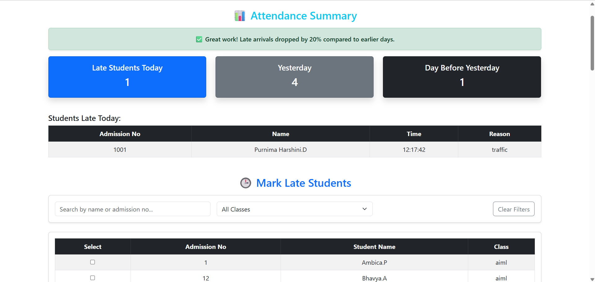
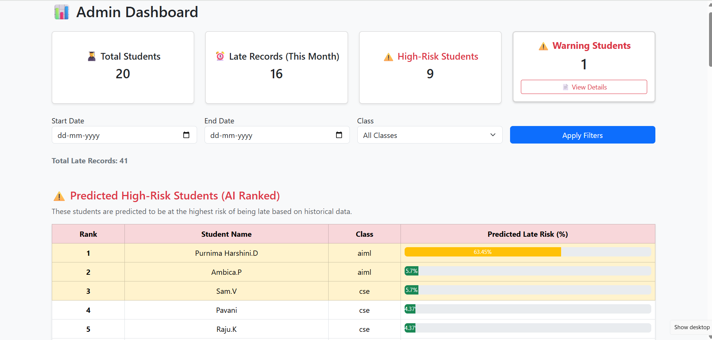
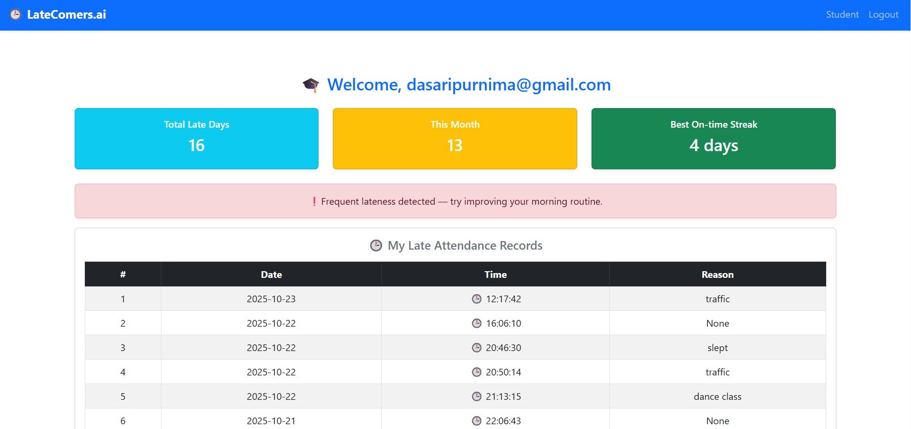
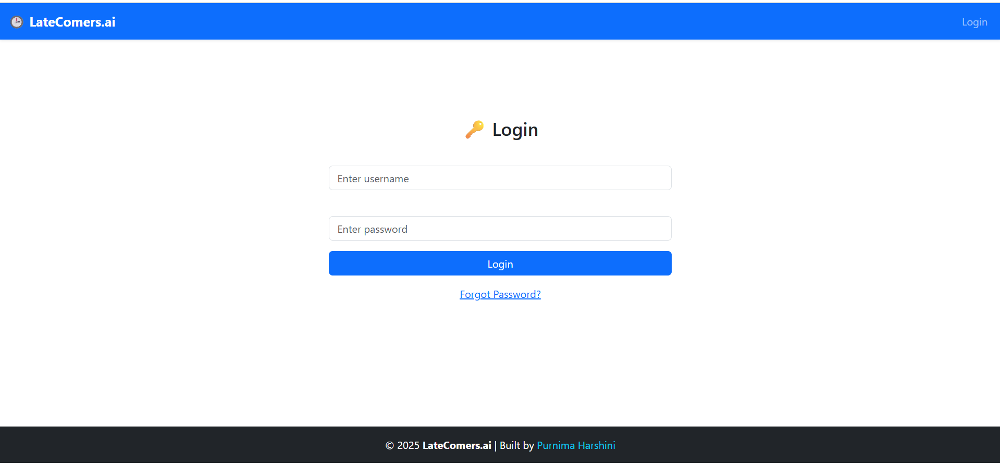

 
🔗 **View Code | 🧠 Built with Flask, MySQL & AI Insights**

#      🕒 Latecomers Attendance Management System

An intelligent, AI-enhanced web platform built with **Flask (Python)** that automates tracking of late student arrivals, improves teacher productivity, and strengthens parent-school communication through **real-time notifications and analytics dashboards**.

---

## 🚀 Features:

### 👩‍🏫 Teacher Dashboard
- Mark late students (single or bulk selection)
- Add reasons for lateness  
- Visualize daily and weekly attendance trends with interactive charts  
- See **AI-powered punctuality insights** (e.g., "Late arrivals dropped by 20% this week")  
- Identify **repeat offenders** (students late multiple times this week)
- Quick filtering by class or student name  

### 👨‍🎓 Student Dashboard
- View personal late arrival records  
- Track dates, times, and reasons of lateness  
- Simple and student-friendly UI  

### 🧑‍💼 Admin Dashboard
- Analyze lateness data across classes  
- Export reports in **CSV or PDF formats**  
- Access **AI-generated risk reports** identifying high-risk students  
- View late reasons distribution and trends  
- Receive **AI-driven suggestions** for attendance improvement  

### 📬 Notifications
- Automated **email alerts** to parents when a student is marked late  
- (Optional) Can be extended with **SMS notifications**  

### 🧠 AI Analytics
- Machine-learning–based lateness risk prediction  
- AI-generated insights and attendance summaries  

---

## 🛠️ Tech Stack

| Category | Technology |
|-----------|-------------|
| Backend | Python, Flask, SQLAlchemy |
| Frontend | HTML5, CSS3, Bootstrap 5, Plotly.js |
| Database | SQLite |
| Authentication | Flask-Login, bcrypt |
| Notifications | SMTP (Email), SMS Gateway (optional) |
| AI Utils | Python (Custom logic & ML integration) |

---

## ⚙️ Installation & Setup:
```
1️⃣ Clone the repository
git clone https://github.com/purnimaharshini/latecomers_web.git
cd latecomers_web


2️⃣ Create a virtual environment
python -m venv venv
venv\Scripts\activate  # (on Windows)

3️⃣ Install dependencies
pip install -r requirements.txt

4️⃣ Set up environment variables (.env)
SECRET_KEY=your_secret_key
MAIL_SERVER=smtp.gmail.com
MAIL_PORT=587
MAIL_USERNAME=your_email@gmail.com
MAIL_PASSWORD=your_app_password
MAIL_USE_TLS=True

5️⃣ Run the application
python app.py

⚠️ Note: Create your own .env file with your credentials.
This project does not include any real secrets or emails for security reasons.

Visit 👉 http://127.0.0.1:5000
```
---

## 🧭 Dashboards Overview

### 👩‍🏫 Teacher View
- Mark students late (bulk or single)
- Attendance charts (daily + weekly)
- Repeat offender summary
- AI punctuality insights and tips  

### 🧑‍💼 Admin View
- Class-wise lateness summary
- AI-driven student risk detection
- Data export (CSV/PDF)
- Weekly lateness trend visualization  

---

## 💡 Future Enhancements
- SMS alerts to parents (Twilio Integration)
- Mobile-friendly **Progressive Web App (PWA)**
- Predictive analytics using ML models
- Integration with **student performance profiles**

---

## 👩‍💻 Author

**Purnima Harshini**  
🎓 *B.Tech – Final Year (2026 Batch)*  
💡 Passionate about **AI-driven educational tools** & **full-stack development**

---


---

### 🖼️ Screenshots

| Dashboard | Description |
|------------|-------------|
|  | Mark late students, view attendance trends & repeat offenders |
|  | Analyze lateness data, generate AI reports & export results |
|  | Track personal attendance & lateness history |
|  | Secure login for students, teachers & admins |

---

## Final version - working locally


## 🧾 License
This project is **open-source** and available for **educational and portfolio use**.  
© 2025 **LateComers.ai | Built by Purnima Harshini**
